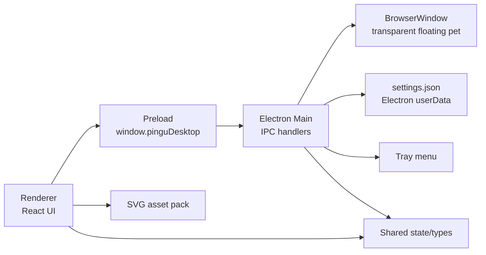
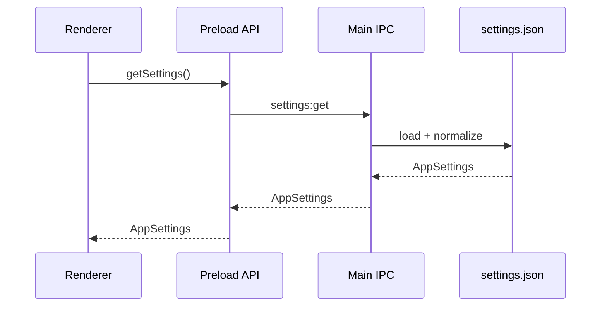
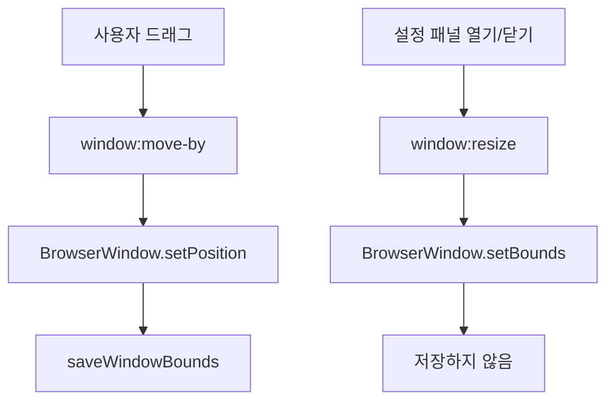

# 아키텍처와 기술 스택

이 문서는 현재 코드 기준으로 Pingu Desktop Pet의 기술 스택, 런타임 구조,
데이터 흐름, 주요 타입과 API 경계를 정리합니다.

## 기술 스택

- Electron 42: 데스크탑 창, 트레이, OS 설정, IPC
- React 19: 펫 UI와 설정 패널
- TypeScript 5.8: main, preload, renderer, shared 타입
- Vite 6 / electron-vite 3: 개발 서버와 빌드 파이프라인
- Vitest 3: shared 로직과 main helper 단위 테스트
- electron-builder 26: macOS dmg, Windows nsis 패키징 설정

주요 명령은 `package.json`에 정의되어 있습니다.

- `npm run dev`: Electron 개발 실행
- `npm run test`: Vitest 단위 테스트
- `npm run typecheck`: TypeScript 타입 검사
- `npm run build`: typecheck, test, electron-vite build
- `npm run dist:mac`, `npm run dist:win`: 패키징

## 런타임 구조



### Main process

main process는 OS와 가까운 책임을 가집니다.

- 투명 frameless `BrowserWindow` 생성
- always-on-top 설정
- 창 위치 이동, reset, 런타임 resize
- `settings.json` 로드/저장
- 트레이 메뉴 생성
- 앱 종료와 macOS activate 처리
- IPC endpoint 등록

설정 저장 위치는 기본적으로 Electron `app.getPath("userData")/settings.json`입니다.
수동 검증 시에는 `PINGU_USER_DATA_DIR` 환경 변수로 저장 위치를 바꿀 수 있습니다.

### Preload

preload는 renderer에 제한된 API만 노출합니다. renderer는 Node API나 Electron IPC에
직접 접근하지 않고 `window.pinguDesktop`만 사용합니다.

### Renderer

renderer는 React로 구성되어 있으며, 다음 책임만 가집니다.

- 현재 펫 상태에 맞는 SVG 표시
- CSS 기반 저강도 애니메이션
- 클릭으로 설정 패널 열고 닫기
- pointer event 기반 창 드래그
- 설정 토글과 reset/quit 버튼 처리
- 장시간 미입력 시 `sleepy` 상태 전환

### Shared

shared 모듈은 main과 renderer가 함께 쓰는 순수 TypeScript 코드입니다.

- 설정 타입과 preload API 타입
- 펫 상태, 이벤트, reducer
- 설정 기본값과 bounds 정규화
- asset manifest 검증과 fallback 선택

## 주요 인터페이스

`PinguDesktopApi`는 renderer가 사용할 수 있는 공개 경계입니다.

```ts
type PinguDesktopApi = {
  getSettings(): Promise<AppSettings>;
  updateSettings(patch: Partial<AppSettings>): Promise<AppSettings>;
  resetWindowPosition(): Promise<AppSettings>;
  moveWindowBy(delta: { x: number; y: number }): Promise<AppSettings>;
  resizeWindow(payload: ResizeWindowPayload): Promise<AppSettings>;
  setAlwaysOnTop(enabled: boolean): Promise<AppSettings>;
  quit(): Promise<void>;
  getAppInfo(): Promise<AppInfo>;
};
```

`AppSettings`는 로컬 저장의 중심 타입입니다.

```ts
type AppSettings = {
  windowBounds: WindowBounds;
  alwaysOnTop: boolean;
  launchAtLogin: boolean;
  selectedAssetPack: string;
};
```

`PetEvent`와 `PetMood`는 펫 반응 모델의 중심입니다. v1에서 실제 사용하는 이벤트는
`app_started`, `user_clicked`, `user_drag_started`, `user_drag_ended`,
`idle_timeout`, `settings_changed`입니다. 타이머와 일정 기능을 위해
`timer_started`, `timer_paused`, `timer_completed`, `schedule_due`가 예약되어 있습니다.

`PetAssetManifest`는 asset pack 교체를 위한 고정 인터페이스입니다.

```ts
type PetAssetManifest = {
  id: string;
  displayName: string;
  license: "official-licensed" | "placeholder" | "custom";
  states: Record<PetAssetState, string>;
};
```

## 데이터 흐름

### 설정 로드와 저장



설정 파일이 없거나 JSON 파싱에 실패하면 기본값으로 복구합니다. 저장된 창 위치가
현재 디스플레이 밖이면 기본 위치로 되돌립니다.

### 창 이동과 resize

드래그 이동은 실제 위치를 저장합니다. 설정 패널을 열고 닫기 위한 programmatic resize는
런타임에서만 적용하며, stale resize 요청이 저장된 위치를 덮어쓰지 않도록 저장하지 않습니다.



### Asset pack

renderer는 manifest와 상태별 SVG를 import한 뒤 `PetMood`에 맞는 asset을 선택합니다.
상태별 asset이 빠져 있으면 idle asset으로 fallback합니다.

## 개발 모드 주의사항

macOS 개발 모드에서는 `app.setLoginItemSettings`가 로그인 항목 등록 권한 오류를
터미널에 출력할 수 있습니다. 현재 앱은 설정값 저장을 계속 진행하므로 개발 자체에는
문제가 없습니다. 실제 OS 등록 안정화는 패키징된 앱 기준으로 후속 처리합니다.
